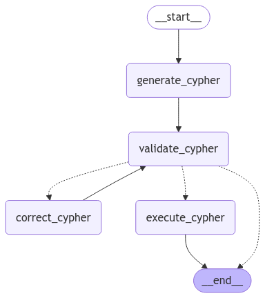
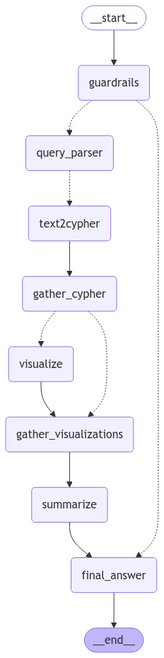
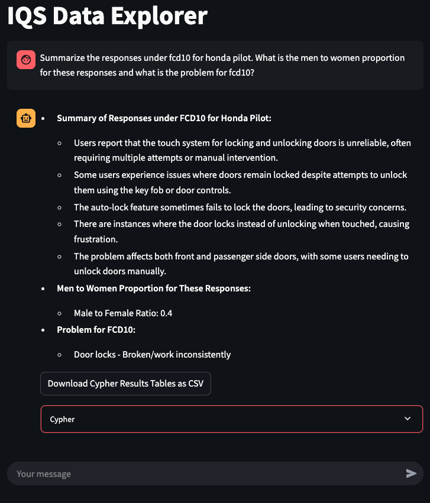
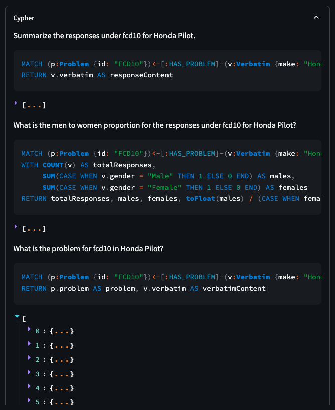
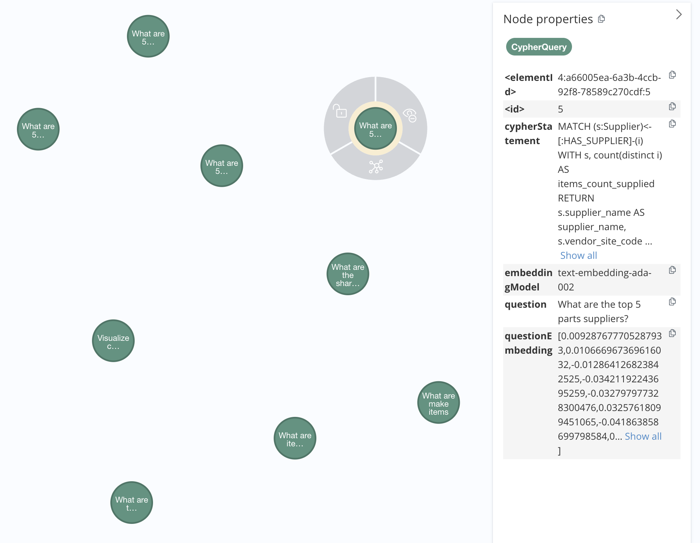

# PS GenAI Agents

This repository contains the `ps-genai-agents` package which may be used to create off-the-shelf agentic workflows built for Neo4j. The purpose of this repo is to provide foundational agents and workflows that may function with any underlying Neo4j graph. While these workflows should function well on their own - it is expected that they will be augmented to serve more specific use cases once pulled into other projects. 

This package uses the [LangChain](https://github.com/langchain-ai) and [Neo4j GraphRAG](https://github.com/neo4j/neo4j-graphrag-python) libraries for LLM and database connections.

This package uses [LangGraph](https://github.com/langchain-ai/langgraph) for workflow orchestration.

## Contents

This repository contains
* Predefined agentic workflows for 
  * Text2Cypher
  * Data Visualization 
* Cypher Query Vector Store Ingestion Code
* Streamlit Demo Application
* LangGraph Studio Integration
* Example Notebooks

## Getting Started

### Basic Set Up
To use `ps-genai-agents` package you can either clone or fork the repository. 

Then:
* Install all the dependencies using Poetry by running `poetry install --with dev, ui`
* Provide a `.env` file to connect to your Neo4j database and LLM provider
* Create a `queries.yml` file containing question and Cypher pairs to use for the Text2Cypher agent that follows the format of `example-queries.yml`

*Note: The queries.yml file will contain questions that define the scope of your application.*

### Streamlit Demo App | *Optional*
To use the Streamlit application
* Create a config JSON file that follows the format of `example-ui-config.json`
* Run with `poetry run streamlit run streamlit_app.py path/to/config.json`

### LangGraph Studio | *Optional*
To Use LangGraph Studio
* Ensure that the `.env` file contains the following
  * LANGSMITH_API_KEY="..."
  * LANGSMITH_TRACING=true
  * LANGSMITH_ENDPOINT="..."
  * LANGSMITH_PROJECT="..."
* Deploy a development LangGraph Studio server from the CLI with `langgraph dev`

LangGraph Studio will use the workflow created in `ps_genai_agents/agent.py` with the variable name `graph` by default. 

You may modify what workflow is used by modifying the contents of `langgraph.json`.

You may find additional documentation on LangGraph Studio [here](https://langchain-ai.github.io/langgraph/concepts/langgraph_studio/).

## Agents & Workflows

This repository contains single and multi-agent workflows. The single agent workflows primarily function as subgraphs in larger multi-agent workflows, but may be run independently.

All agents and workflows are built with async and run asynchronously. Please reference the example notebooks and Streamlit application code for implementation details.

### Text2Cypher

This agent will generate, validate, correct and execute Cypher statements. 
This agent requires Cypher examples to inform the Cypher generation step. 
Cypher validation may be performed using an LLM or the validation logic found in  `ps_genai_agents/components/text2cypher/validation/`.

Validation Checks
* No Syntax Errors
* No Write Clauses 
* Proper Relationship Directions
* Correct Property Mappings
* Node Label Existence
* Relationship Type Existence
* Property Existence

This agent is based on the work done by Tomaz Bratanic and the original code may be found in the LangChain documentation [here](https://python.langchain.com/docs/tutorials/graph/).

Below is the agent workflow.

### Data Visualization

This agent will generate visualizations using Matplotlib and Seaborn based on the provided data. It will also include a description of the visual.

Possible Plots 
* Line
* Bar
* Scatter

Below is the agent workflow.

### Multi-Agent Workflows

The multi-agent workflows contain combinations of the above agents as well as the nodes below.
* Guardrails
  * Identify whether an input question is in scope
* Question Parsing
  * Identify and address individual questions found in input question
* Summarization
  * Summarize the results in an easy to digest format

Below is an example of a multi-agent workflow that includes both Text2Cypher and data visualization.

## Streamlit Application

This is a demo application that demonstrates a simple UI.

Responses will include 
* Summary of retrieved data
* Any visualizations generated and their descriptions
* Download option for retrieved data tables
* Cypher queries and results for each question identified in the input question

Below is an example text response using the IQS data.

Below are the Cypher details contained in the Cypher dropdown seen above.

## Cypher Query Vector Store

This repo contains code to create and update a Cypher query Vector Store in Neo4j. This can then be used retrieve examples for Cypher generation. This provides the benefit of allowing many Cypher queries to be accessible without needing to store them in a YAML file or passing them *all* in the prompt. We can instead select the top k most relevant queries by matching the input question embedding to question embeddings in the vector store. 

By using this method we
* Reduce tokens passed to the LLM
* Reduce processing time
* Reduce processing cost
* Increase the scope of our application
* Remove irrelevant examples for a specific question

Below we see a sample of the Cypher Queries stored in Neo4j.

